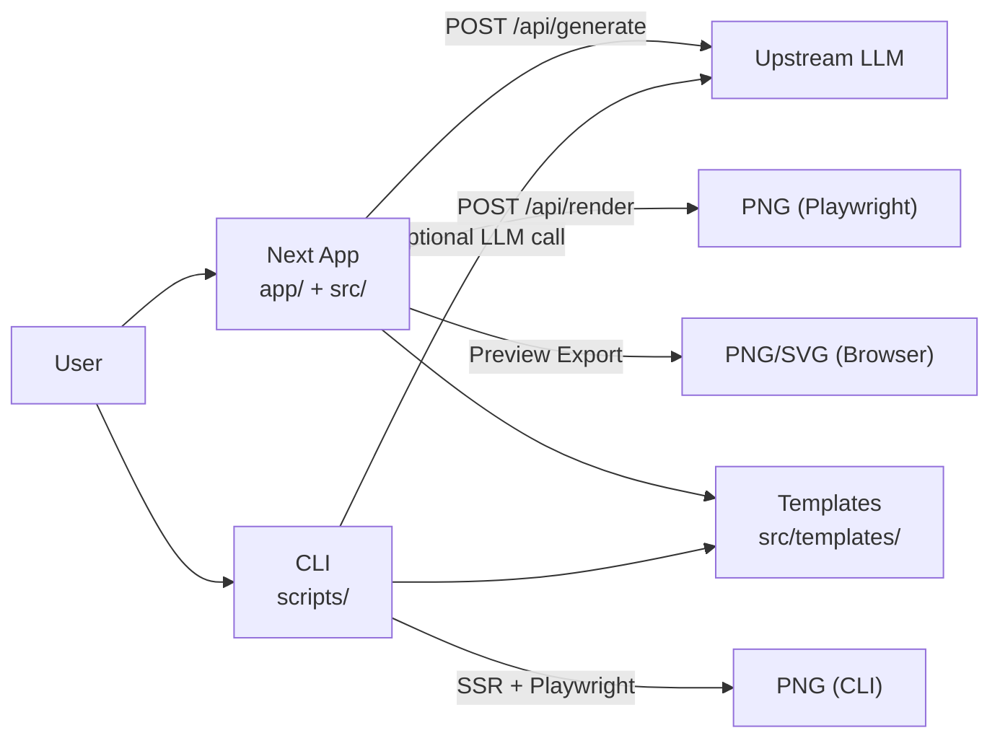

# juya-news-card

一个基于 Next.js + React + TypeScript 的新闻卡片生成与渲染工具，支持模板预览、服务端 LLM 生成、PNG 导出（前端或后端渲染）。
> 声明：这是一个 `100% AI` 项目，`0` 人工编写。


## 特性
- 输入新闻文本，服务端调用 LLM 生成结构化卡片
- 174 个主题模板统一渲染（`templates/`）
- PNG 导出支持两种模式：浏览器渲染 / 后端 Playwright 渲染
- Next 一体化运行：页面与 API 同进程（`/api/generate`、`/api/render`、`/api/config`）

## 项目组成（Next 一体化 / CLI / Skill / Prompt）
| 模块 | 主要入口 | 用途 | 典型命令 |
| --- | --- | --- | --- |
| Next 一体化应用 | `app/` + `pages/api/*` + `src/` | 前后端同进程运行，提供页面和 API（`/api/generate` / `/api/render` / `/api/config`） | `npm run dev` |
| 命令行工具（CLI） | `scripts/` | 本地脚本化生成/批量截图/离线渲染 | `npm run generate` / `npm run batch-generate` / `npm run test-render` |
| Agent Skill | `.agents/skills/juya-news-card-operator/SKILL.md` | 让 Codex/Agent 按固定流程操作本项目（偏自动化工作流） | 在 agent 会话中按 skill 触发 |
| Runtime Prompt（项目内） | `src/services/llm-prompt.ts` | 项目运行时使用的默认系统提示词；用于 `/api/generate` | API 默认读 `DEFAULT_SYSTEM_PROMPT` |
| Standalone Prompt（项目外） | `claude-style-prompt.md` | 独立 Prompt，提供给任意 AI 生成符合 `claudeStyle` 主题的完整 HTML；不被项目运行时自动读取 | 手动复制给任意 AI 使用 |

关系可以简单理解为：
- 常规使用：前端 -> API -> 上游 LLM -> 返回结构化内容 -> 浏览器或 API 渲染 PNG。
- 脚本使用：CLI 直接调用本地逻辑（可走 LLM 或 mock 数据）并输出结果。
- Agent 使用：Skill 约束操作步骤，Runtime Prompt 约束生成质量与格式。
- Standalone Prompt 使用：`claude-style-prompt.md` 是项目外工作流，直接喂给任意 AI 生成 `claudeStyle` HTML。

## 架构图（当前推荐：Next 一体化）


详细说明见 [docs/ARCHITECTURE.md](docs/ARCHITECTURE.md)。

## 环境要求
- Node.js >= 20
- npm >= 10

## 快速开始
1. 安装依赖
```bash
npm install
```
2. 准备环境变量
```bash
cp .env.example .env
```
至少先配置这 3 项：
```env
LLM_API_KEY=your-api-key
LLM_API_BASE_URL=https://api.openai.com/v1
LLM_MODEL=gpt-4o-mini
```
3. 安装 Playwright（首次）
```bash
npx playwright install
```
4. 启动 Next.js 一体化服务（前后端）
```bash
npm run dev
```

## 轻量开源定位
- 这是一个“可用优先”的普通开发者项目，适合分享思路与工具，不要求重度维护。
- 如果你只想快速分享给别人用：保证 `README`、`.env.example`、`LICENSE` 清晰即可。
- 如需更“工程化”的开源标准（CI、Issue 模板、SECURITY.md），可以后续再补，不是阻塞项。

## Docker 运行 Next 一体化服务（推荐）
1. 准备 Docker 环境变量文件
```bash
cp .env.example .env
```
2. 按需修改 `.env`（至少配置 `LLM_API_KEY`、`LLM_API_BASE_URL`、`LLM_MODEL`）
3. 启动服务
```bash
npm run docker:up
```
4. 检查健康状态
```bash
curl http://127.0.0.1:3000/healthz
```

说明：
- 容器内同时提供页面和 `/api/*`。
- 对外端口默认 `3000`。
- `docker compose` 会先读 `.env`，再读 `.env.docker`（可选覆盖）。

## 默认端口
- Next.js 服务：`3000`

## 环境变量（最小心智负担版）
先记住：多数场景至少要配置 3 项。

```env
LLM_API_KEY=your-api-key
LLM_API_BASE_URL=https://api.openai.com/v1
LLM_MODEL=gpt-4o-mini
```

说明：
- 本地开发默认 `npm run dev` 直接在 `3000` 提供前端和 `/api/*`。
- 非生产环境默认允许无 Token 调用写接口，方便开箱即用。
- 生产环境默认不允许无 Token 写接口（更安全）。

如果要公开部署，再加这几项：
```env
API_BEARER_TOKEN=change-me
ALLOW_UNAUTHENTICATED_WRITE=false
```

补充：
- 推荐统一使用 `.env` 作为本地与 Docker 的主配置文件。
- 需要按环境覆盖时再创建 `.env.docker`（仅放差异项）。
- 浏览器端变量优先使用 `NEXT_PUBLIC_*`（兼容读取 `VITE_*`）。
- UI 里的 `App Backend API Base URL` 对应 `NEXT_PUBLIC_API_BASE_URL`（或 `VITE_API_BASE_URL` 兼容名），表示本项目后端地址（用于 `/api/generate`），不是上游 LLM 的 `LLM_API_BASE_URL`。
- `LLM_*` 给服务端调用上游模型用。
- UI 的 LLM 参数为后端只读展示（来自 `/api/config`）；`localStorage` 仅缓存布局/导出/图标映射和 App Backend API Base URL。
- 其余高级参数（LLM 超时/重试、输入长度、Chromium flags）都已给默认值，按需再去 `.env.example` 取消注释即可。

## API
- `GET /api/healthz` 或 `GET /healthz`：健康检查
- `GET /api/config`：返回后端当前生效配置（含 LLM 只读信息，不含密钥）
- `GET /api/themes`：SSR 可用主题列表
- `POST /api/generate`：LLM 生成结构化卡片
- `POST /api/render`：渲染 PNG

## 常用命令
- `npm run dev`：Next.js 前后端一体化开发服务
- `npm run build`：Next.js 构建
- `npm run start`：Next.js 生产启动
- `npm run docker:up`：Docker 启动 Next 一体化服务
- `npm run docker:down`：停止 Docker 服务
- `npm run docker:build`：构建 Docker 镜像
- `npm run test`：运行基础单元测试
- `npm run check`：类型检查 + 构建
- `npm run audit-themes:strict`：模板契约严格检查
- `npm run audit-themes:runtime:critical`：运行时关键风险检查
- `npm run batch-generate -- --all-themes`：全模板批量截图

## 生产部署建议
- 让服务监听 `127.0.0.1`，通过 Nginx/Caddy 暴露 HTTPS。
- 如果需要跨域访问（把 API 给别的前端用），在网关层配置 CORS 白名单。
- 开启 `API_BEARER_TOKEN`（或在网关层做鉴权）。
- 生产环境不要把真实上游密钥暴露到浏览器，统一走 `/api/generate`。
- 将 Playwright 浏览器安装放到镜像构建阶段：
```bash
npx playwright install chromium-headless-shell
```

## 项目结构
- `src/`：前端应用、模板系统、客户端服务（含默认 LLM Prompt）
- `app/`：Next App Router 页面与基础路由（当前仅页面与 `/healthz`）
- `pages/api/`：Next API 路由（`/api/generate` + `/api/render` + `/api/healthz` + `/api/config` + `/api/themes`）
- `server/`：后端核心逻辑（`next-runtime.ts`、`ssr-helper.tsx`）
- `scripts/`：CLI 与批处理脚本（生成、离线渲染、全模板截图、审计）
- `.agents/skills/`：Agent skill 定义（当前含 `juya-news-card-operator`）
- `claude-style-prompt.md`：独立 Prompt（项目外），供任意 AI 生成 `claudeStyle` HTML；不被运行时自动读取
- `docs/ARCHITECTURE.md`：架构与数据流说明
- `tests/`：测试与 mock 数据
- `public/assets/`：静态资源（包含 `htmlFont.ttf`，供模板 `@font-face` 使用）
- `assets/`：仓库内图片资产（README 截图等）；可选用 `assets/htmlFont.ttf` 覆盖 CLI 截图用字体

## 开源说明
- MIT License（见 `LICENSE`）
- 不要提交 `.env`、`.env.docker`、API Key 或其他敏感信息

## 迁移后可移除部分（分析）
以下是按场景的可移除清单，避免误删仍在使用能力。

### A. 已完成移除（Vite 旧链路）
已移除：
- 旧 Vite 入口与配置：`index.html`、`src/main.tsx`、`vite.config.ts`、`vite-env.d.ts`
- `package.json` 中兼容脚本：`dev:vite`、`build:vite`、`preview`
- Vite 相关依赖：`vite`、`@vitejs/plugin-react`

### B. 已完成移除（legacy 独立后端）
已移除：
- `server/render-api.ts`
- Windows legacy 启动脚本：`scripts/windows/start-render-api.bat`、`scripts/windows/start-render-api.ps1`
- legacy 专用容器文件：`nginx.conf`、`Dockerfile.frontend`

### C. 仍建议保留
- `server/next-runtime.ts`：当前 Next API 实际依赖
- `scripts/` 与 `tests/`：CLI/审计/回归能力
- `.agents/skills/`：自动化操作流程
