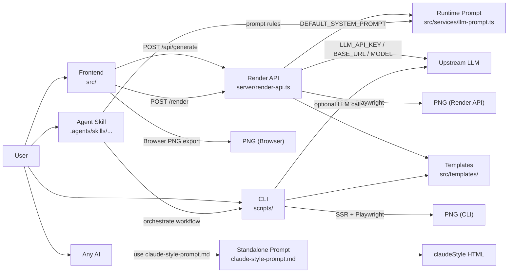

# Architecture

## Scope
This project is split into 5 runtime parts (+ 1 standalone prompt asset):
- `Frontend` (`src/`): UI editing, template preview, export trigger.
- `API` (`server/render-api.ts`): `/api/generate` + `/render` + health/theme endpoints.
- `CLI` (`scripts/`): local scripts for generation, batch rendering, and audits.
- `Skill` (`.agents/skills/juya-news-card-operator/SKILL.md`): workflow constraints for agent operation.
- `Runtime Prompt` (`src/services/llm-prompt.ts`): text-to-card extraction rules used by API.
- `Standalone Prompt` (`claude-style-prompt.md`): not part of runtime; can be given to any AI to generate claudeStyle HTML.

## Runtime Flow

## Module Responsibilities
| Part | Inputs | Outputs |
| --- | --- | --- |
| Frontend | Raw text, theme selection, global settings | API requests, browser-side PNG |
| API | Structured render request or raw text | Generated card JSON, render PNG |
| CLI | Command args, env vars, mock data | HTML/PNG files under `output/` |
| Skill | User goal + repository context | Standardized execution path (template -> content -> render) |
| Runtime Prompt | Raw text | Markdown/JSON-like structured card content |
| Standalone Prompt | Any news/article text | Standalone claudeStyle HTML (outside project runtime) |

## Standalone Prompt Clarification
- `claude-style-prompt.md` is intentionally independent from project runtime.
- Frontend/API/CLI do not auto-load or depend on this file.
- It is a reusable prompt asset you can copy to any AI model to generate HTML matching `claudeStyle`.

## Minimal Env Strategy
- Local quick start: configure all 3 items `LLM_API_KEY`, `LLM_API_BASE_URL`, `LLM_MODEL`.
- Production hardening: set `API_BEARER_TOKEN`, `ALLOW_UNAUTHENTICATED_WRITE=false`, and strict `CORS_ALLOW_ORIGIN`.
